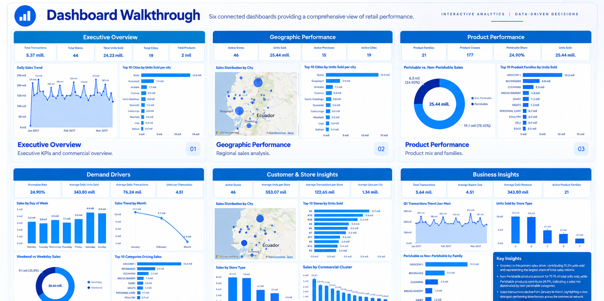
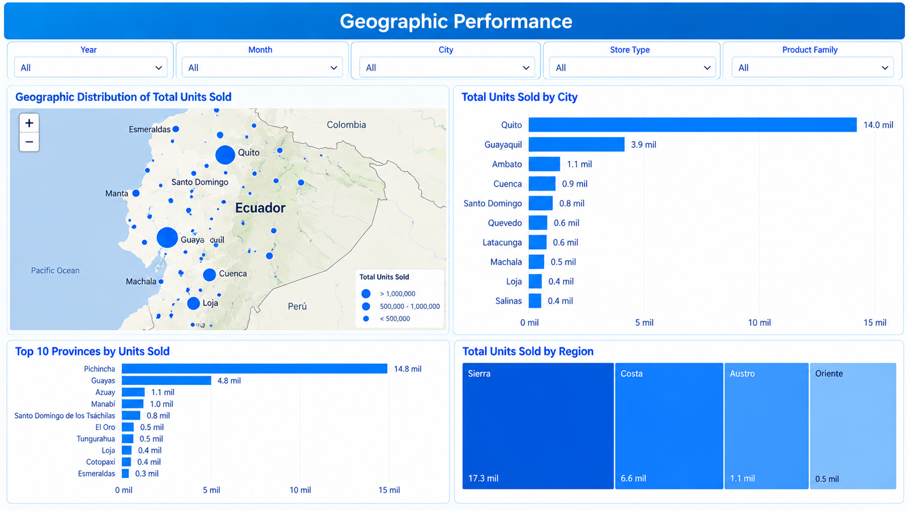
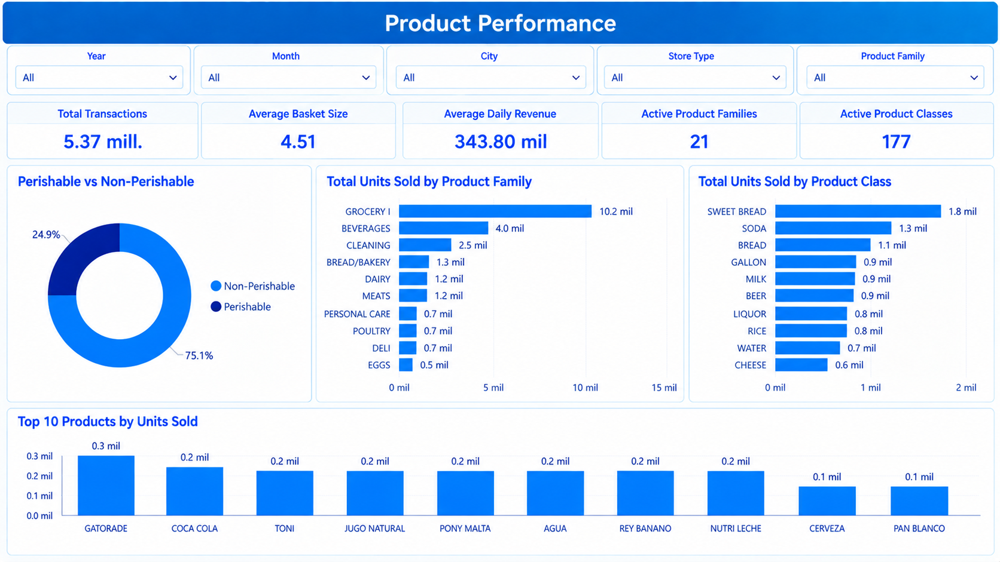
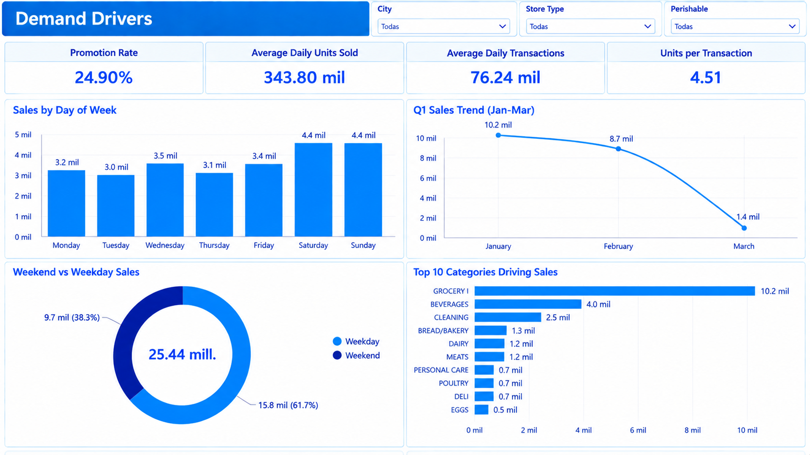

# Retail Commercial Analytics Dashboard (Power BI)

Executive Business Intelligence dashboard analyzing **25.44 million retail units sold across Ecuador (Q1 2017)** using **Power BI, DAX, Power Query, Python, and Excel**.

---

## Technologies


---

## Executive Summary
Dashboard Preview

This project analyzes retail sales performance across Ecuador through an executive commercial dashboard built in **Power BI**.

The solution transforms transactional retail data into actionable business insights from six commercial perspectives:

* Executive Overview
* Geographic Performance
* Product Performance
* Demand Drivers
* Customer & Store Insights
* Business Insights

The dashboard was designed to help commercial managers identify growth opportunities, optimize product assortment, monitor KPIs, and support data-driven decision making.


# Retail Commercial Analytics Dashboard (Power BI)

Executive Power BI dashboard analyzing **25.44 million retail units sold** across Ecuador using **Power BI, DAX, Power Query, Python, and Excel** for commercial analytics.

---

## Executive Summary

This project analyzes retail sales performance across Ecuador during **Q1 2017** through an executive Business Intelligence dashboard.

The solution consolidates **5.44 million retail transactions** into interactive dashboards that help commercial teams monitor sales performance, customer behavior, geographic opportunities, and product mix across multiple retail locations.

### Business Questions

* Which cities generate the highest sales volume?
* Which product families contribute the most units sold?
* How do weekday and weekend purchasing patterns differ?
* Which store types and commercial clusters perform best?
* What seasonal trends affect commercial performance?

---

## Dashboard Walkthrough

> Six connected Power BI dashboards providing a complete commercial view of retail performance.



---

## Dashboard Pages

### Executive Overview

Executive KPIs and commercial performance summary.


### Geographic Performance

Sales distribution across Ecuador including cities, provinces, and commercial clusters.


### Product Performance

Product mix analysis including product families, product classes, and top-selling products.


### Demand Drivers

Analysis of weekday/weekend behavior, monthly sales trends, promotions, and demand drivers.


### Customer & Store Insights

Store performance by city, store type, commercial cluster, and transactions.

### Business Insights

Executive commercial findings and recommendations based on interactive KPI analysis.

---

## Technologies Used

| Technology  | Purpose                                |
| ----------- | -------------------------------------- |
| Power BI    | Interactive dashboard development      |
| DAX         | KPI calculations and business measures |
| Power Query | ETL, cleansing, and transformations    |
| Python      | Exploratory Data Analysis (EDA)        |
| Excel       | Data exploration and validation        |

---

## Skills Demonstrated

### Business Intelligence

* Executive Dashboard Design
* KPI Development
* Business Storytelling
* Interactive Reporting

### Data Analytics

* Data Modeling
* DAX Measures
* ETL with Power Query
* Exploratory Data Analysis (Python)

### Commercial Analytics

* Sales Performance Analysis
* Geographic Analysis
* Product Mix Optimization
* Customer Purchasing Behavior
* Retail Performance Monitoring

---

## Key Business Insights

* Grocery I generated **10.2 million units sold**, representing the largest product family.
* Non-perishable products account for **75.1%** of total units sold.
* Weekend sales generated the highest commercial volume.
* Store Types A and D concentrated the largest sales volume.
* Sales declined during March, indicating seasonal demand during Q1.

---

## Business Impact

This dashboard enables commercial managers to monitor retail performance through executive KPIs and interactive visualizations.

The analysis supports assortment optimization, geographic expansion, sales monitoring, customer segmentation, and executive decision-making through a single Business Intelligence solution.

---

## Dataset

**Source:** Kaggle — Retail Store Sales Dataset (Ecuador)

**Period:** January – March 2017

### Coverage

* 44 Stores
* 19 Cities
* 15 Provinces
* 21 Product Families
* 177 Product Classes
* 5.44 Million Transactions

---

## Repository Structure

```text
Retail-Commercial-Analytics-Dashboard
│
├── Dashboard
│   └── Retail-Commercial-Analytics-Dashboard.pbix
│
├── Images
│   ├── Executive-Overview.png
│   ├── Geographic-Performance.png
│   ├── Product-Performance.png
│   ├── Demand-Drivers.png
│   ├── Customer-Store-Insights.png
│   ├── Business-Insights.png
│   └── Dashboard-Walkthrough.png
│
├── Python
│   └── Retail_Sales_EDA.ipynb
│
├── Data
│   └── retail_sales_dataset.csv
│
└── README.md
```

---

## Author

**Carlo Perez Flores**

Commercial Analytics | Business Intelligence | Power BI | Python | SQL | Supply Chain Analytics
